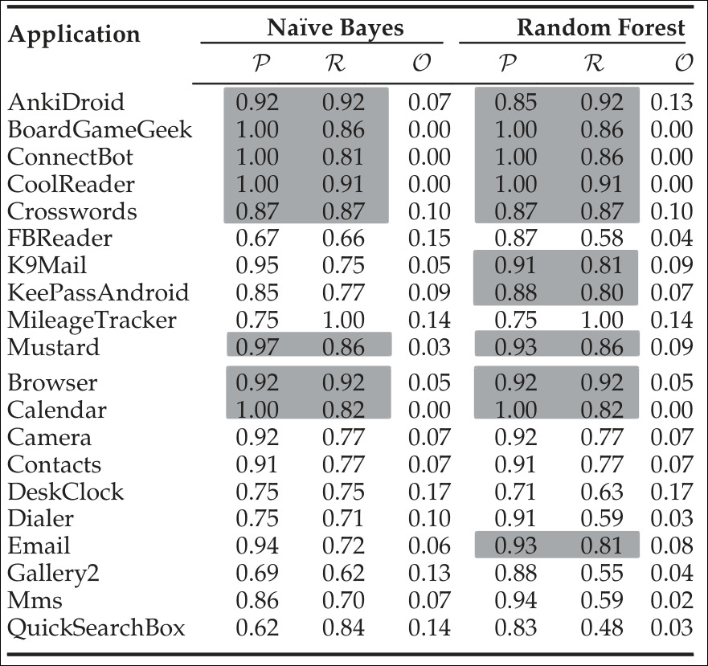
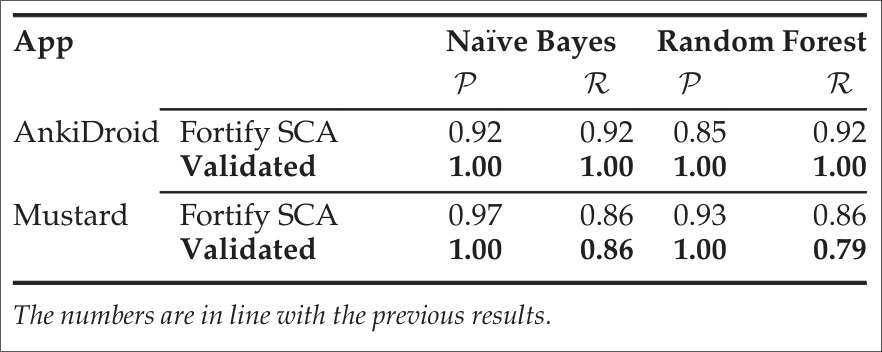
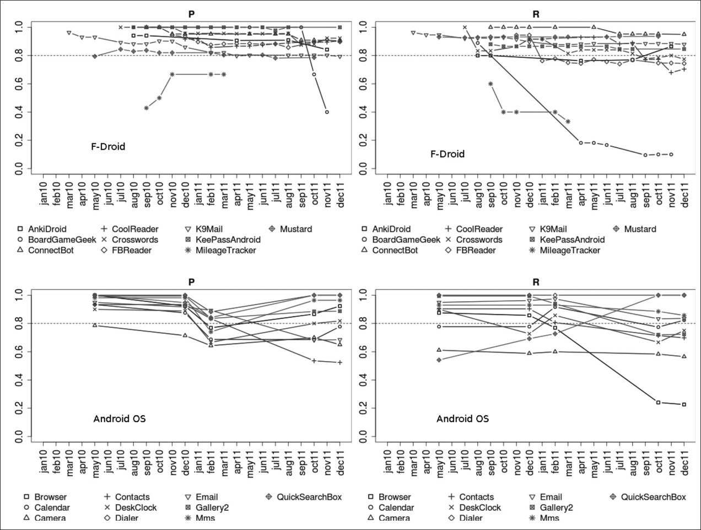
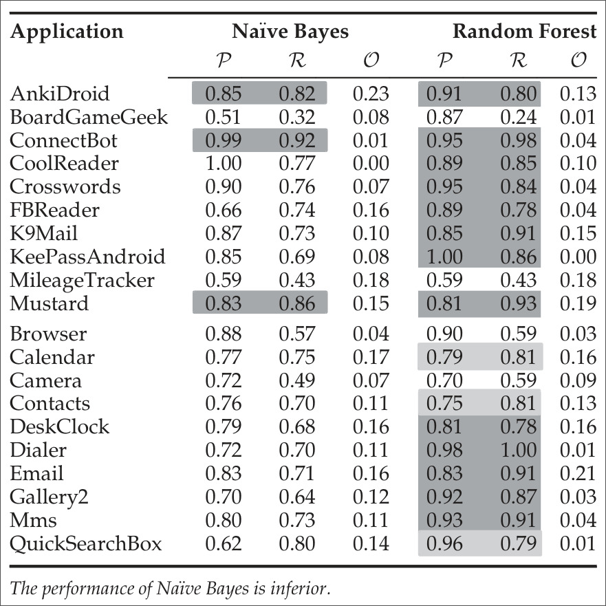
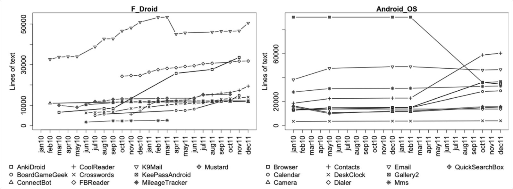
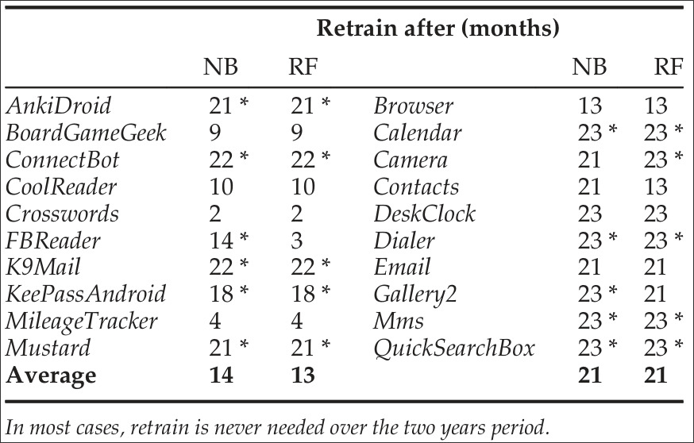
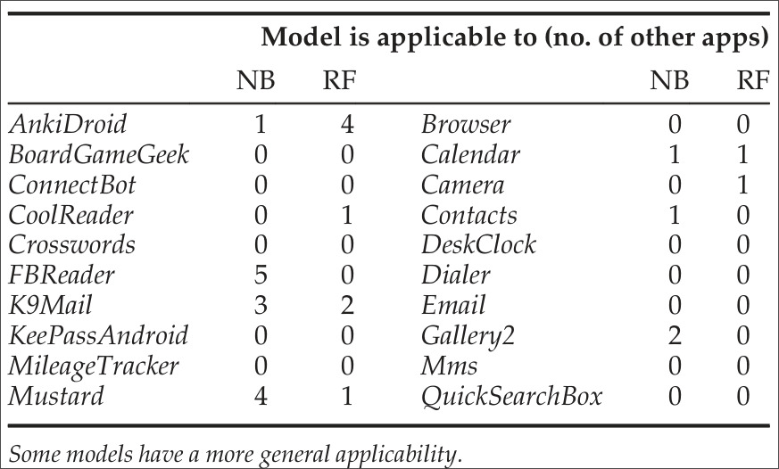

# Conceitos principais

## Mineração de dados/texto

- Técnica de aprendizado de máquina

- Extração de informação e características

- Descoberta de padrões e subgrupos

- Modelos de classificação

## Vulnerabilidade de componentes de Software

- Fraqueza no sistema
  - Suscetibilidade a ser explorada por ameaças ou problemas aleatórios
  - Sistema vulnerável: existe uma oportunidade para uma ameaça quebrar sua segurança

- Causas
  - Erros
  - Falhas no projeto de software

- Exemplos
  - Códigos com vazamento de memória

# Projeto de pesquisa realizado

## Introdução

- Utilização de técnicas de mineração de textos para classificação de vulnerabilidades em componentes de Software

- Grande relevância no mundo contemporâneo
  - Internet das Coisas
  - Privacidade e segurança

- Hipótese principal: conseguir classificar códigos que contenham vulnerabilidades

- Aplicações e impactos
  - Demonstra força da área de ciência de dados aplicada à cibersegurança
  - Redução de custos, mais segurança, etc

## Trabalhos relacionados

- Aprendizado de máquina já foi aplicado na área da cibersegurança
  - Diferentes *features* de classificação foram utilizadas, em diversas bases de dados
  - Diferentes objetivos: localizar vulnerabilidades, identificar correlações entre variáveis, etc
  - Muitas visavam predizer defeitos e não necessariamente vulnerabilidades

- Análise estática de código
  - *Fortify Source Code Analyzer* (SCA) - ferramenta de análise estática de código para identificar potencias vulnerabilidades no código
  - Utilizado para criação das *labels* do conjunto de dados

## Metodologia de pesquisa

- Objetivo: construir um classificador binário para predizer se um software é provável de ser vulnerável

- Dados utilizados: arquivos de texto com códigos escritos em Java

- Métrica para construção das *labels*: um código é dito vulnerável se a ferramenta SCA aponta um ou mais avisos em sua análise e não vulnerável caso contrário

- Predições analisadas com base em uma matriz de confusão
  - Verdadeiros positivos (TP)
  - Falsos positivos (FP)
  - Falsos negativos (FN)
  - Verdadeiros negativos (TN)

## Indicadores de performance

- Precisão (*P*) e Revocação (*R*)

$$
    P = \frac{TP}{TP + FP} \quad
    R = \frac{TP}{TP + FN}
$$

- F-Score (*F*)

$$
    F_\beta = \frac{{(1 + \beta^2)PR}}{{\beta^2P + R}}
$$

- Fall-out (*O*)

$$
    O = \frac{FP}{FP + TN}
$$

- *Benchmark*: 80% ou mais para ambas precisão e revocação

## Conjuntos de dados

- Aplicações *mobile* da plataforma *Android*

- Considerações nas decisões:
  - Linguagem de Programação (Java)
  - Tamanho (1000 linhas de código no mínimo)
  - Número de versões (ao menos 5)

- 10 aplicações escolhidas ao final
- 10 aplicações pré-instaladas do *Android* foram adicionadas

## Conjunto de variáveis relevantes

### Variáveis dependentes

- Ferramentas de análise estática de código são custosas
- SCA: escaneia o código e monta um relatório de possíveis falhas
- Reporta tipo de vulnerabilidade juntamente com sua escala de ameaça (trabalhos futuros)

### Variáveis independentes

- Cada arquivos de código é analisado conforme um *pipeline*
- Tokenização, contagem de caracteres, etc

## Exemplos

- Feature Vector para o arquivo `HelloWorldApp.java`:

`args: 1, class: 2, main: 2, HelloWorldApp: 2, The: 1, out: 1, println: 1, prints: 1, public: 1, static: 1, String: 1, System: 1, Hello: 1, void: 1, World: 2`

## Técnicas de aprendizado de máquina utilizadas

- *Labels* e *features* já definidas

- *No free lunch theorem*

- Inicialmente, cinco algoritmos famosos foram considerados

- Dois apresentaram melhores resultados inciais: *Naive Bayes* (NB) e *Random Forest* (RF)

- Ferramenta utilizada: Weka

- Discretização de *features*: limpagem do conjunto de dados

## Principais perguntas a serem respondidas

- Um modelo preditivo pode ser criado?

- Predições sobre vulnerabilidades futuras podem ser feitas?

- Predições entre diferentes projetos podem ser feitas?

## Um modelo preditivo pode ser criado?

- Versão Inicial $v_0$
- *Cross Validation* 10-*fold*
  - Evitar *overfitting*

## Um modelo preditivo pode ser criado?

{ width=70% }

## Um modelo pode ser criado

- 11 dos 20 aplicativos foram "excelentes" com pelo menos um dos algoritmos
- "Bom o suficiente": 75% de recall: 15 (NB) e 14 (RF)
- Restam algumas dúvidas
  - Influência do tamanho do arquivo
  - Influência dos falso positivos
  - Experimentando com dados "reais"

## Influência do tamanho dos arquivos

- Códigos maiores naturalmente são mais propensos a *bugs* e falhas de segurança
- Na prática: apenas olhar o tamanho é muito mais ineficiente do que o método proposto
  - Queda de 25% na precisão
  - Queda de 37% no *recall*

## Influência dos falsos positivos

- Ferramentas de análise estática de código podem cometer erros
- Para mitigar isso, dois aplicativos foram inspecionados "manualmente": AnkiDroid e Mustard
- "Custo": 2 dias de trabalho
- Resultados
  - AnkiDroid: 10 de 12 FP
  - Mustard: 14 de 43 FP

## Influência dos falsos positivos

{ width=70% }

## Influência dos falsos positivos

- Melhora dos algoritmos, de forma geral
  - Resultados anteriores seriam um "limite inferior"
- Mas realmente são?

## Experimentando com dados "reais"

- Drupal
  - PHP
  - Falhas de segurança bem documentadas
  - Métricas semelhantes a alguns aplicativos: número de arquivos, número de termos e taxa de positivos
- Resultados
  - NB: *recall* 73% e precisão 55%
  - RF: *recall* 82% e precisão 59%
- Na prática: redução em 45% de arquivos para checar

## Predições sobre vulnerabilidades futuras

- Modelo da versão inicial testado nas versões subsequentes
- Não somente se é possível, mas por quanto tempo é possível
  - Limite arbitrário: deterioração de 10% da performance do $F_2$

## Predições sobre vulnerabilidades futuras

{ width=85% }

## Predições sobre vulnerabilidades futuras

{ width=70% }

## Predições sobre vulnerabilidades futuras

- Desempenho satisfatório, especialmente no *recall*, que é mais importante
- Apenas 4 aplicações não "se aproximaram" de ter um desempenho favorável
  - MileageTracker: poucos arquivos
  - BoardGameGeek: refatoração na $v_2$
  - Browser: aumento no número de vulnerabilidades
  - Camera: autores não comentam
- Estariam os dados apenas sendo "decorados"?
  - Arquivos em comum com a versão inicial
  - Por outro lado, o tamanho dos aplicativos varia bastante
  - E vulnerabilidades presentes em um arquivo são removidas
  - Ou ausentes são adicionadas (com o passar do tempo)

## Predições sobre vulnerabilidades futuras

## Predições sobre vulnerabilidades futuras

## Predições sobre vulnerabilidades futuras

- Performance naturalmente decai com o tempo
- Mas se mantém estável para 11 casos
- Tempo médio para retreino:
  - F-Droid: 13 meses
  - Sistema Operacional: 21 meses

## Predição entre projetos

- Objetivo ambicioso
- Até então não testado na área de predição de vulnerabilidades
- 20 modelos usando as versões iniciais de cada aplicativo
- Testando nos outros 19 aplicativos, para cada aplicativo
- Objetivo: atingir o *benchmark*
  - Falta de análise mais precisa (somente resposta binária)

## Predição entre projetos

## Predição entre projetos

- Maioria (13) dos aplicativos não são generalizáveis
- Os que são, no geral, são generalizáveis em poucos casos
- Aplicativos com mais vulnerabilidades (como o K9Mail) possuem um desempenho melhor
  - Com o RF, $F_2$ em 78%
  - No geral, um *recall* considerável
  - Quantidade de arquivos não parece ser um fator relevante
- Não é esperado que aplicativos que não tiveram uma boa avaliação de versões futuras (como o BoardGameGeek) possuam um bom desempenho em outros projetos

## Predição entre projetos

- É necessária uma análise mais profunda para averiguar os critérios que determinam um bom resultado entre projetos
  - Hipótese: a "natureza" do texto pode ser um fator de importância
- Combinação de aplicativos
  - Analise "futura"
  - Modelo construído usando 2 ou mais aplicativos como treino
  - Aplicativos diversificados

## Ameaças à validade

## Conclusões
